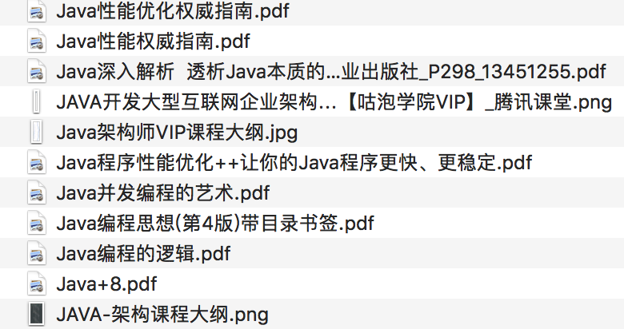
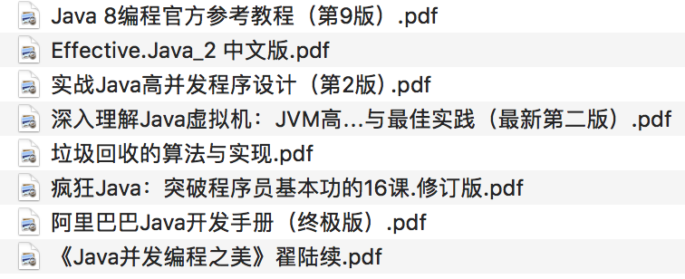
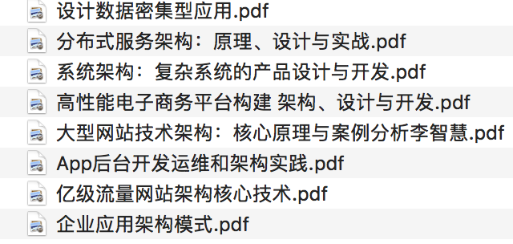
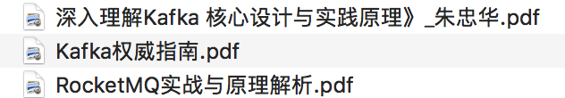
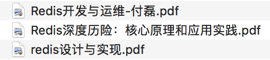
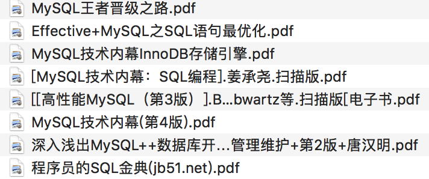
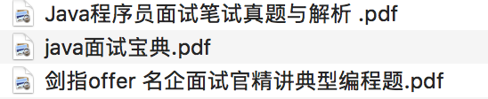
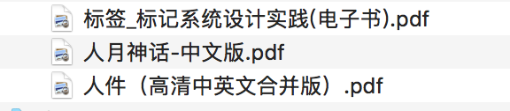

# Java-Interview-Question

> 这里搜罗了网上的一些面试题，还有一些相关知识点，有一些是我站在面试官的角度自问的
>

#### Java面试题整理

| 基础                                                         | 并发                                                         | 锁                                                           | JVM                                                          | 设计模式                                                     | 数据结构                                                     | 反射/IO                                                      |
| ------------------------------------------------------------ | ------------------------------------------------------------ | ------------------------------------------------------------ | ------------------------------------------------------------ | ------------------------------------------------------------ | ------------------------------------------------------------ | ------------------------------------------------------------ |
| [🍼](https://github.com/jujunchen/Java-interview-question/blob/master/1.%20Java%E5%9F%BA%E7%A1%80.md) | [🍭](https://github.com/jujunchen/Java-interview-question/blob/master/2.%20Java%E5%B9%B6%E5%8F%91.md) | [🍩](https://github.com/jujunchen/Java-interview-question/blob/master/3.%20%E9%94%81.md) | [🌮](https://github.com/jujunchen/Java-interview-question/blob/master/4.%20JVM%E7%9F%A5%E8%AF%86.md) | [🍱](https://github.com/jujunchen/Java-interview-question/blob/master/6.%20%E8%AE%BE%E8%AE%A1%E6%A8%A1%E5%BC%8F.md) | [🧀](https://github.com/jujunchen/Java-interview-question/blob/master/7.%20%E6%95%B0%E6%8D%AE%E7%BB%93%E6%9E%84.md) | [🥐](https://github.com/jujunchen/Java-interview-question/blob/master/5.%20Java%E5%8F%8D%E5%B0%84IO.md) |

| 数据库                                                       | Redis                                                        | Spring                                                       | 消息队列                                                     | 分布式                                                       | Zookeeper                                                    | Dubbo                                                        | Spring Cloud                                                 | Mybatis                                                      | Maven                                                        |
| ------------------------------------------------------------ | ------------------------------------------------------------ | ------------------------------------------------------------ | ------------------------------------------------------------ | ------------------------------------------------------------ | ------------------------------------------------------------ | ------------------------------------------------------------ | ------------------------------------------------------------ | ------------------------------------------------------------ | ------------------------------------------------------------ |
| [🌽](https://github.com/jujunchen/Java-interview-question/blob/master/8.%20%E6%95%B0%E6%8D%AE%E5%BA%93.md) | [🍔](https://github.com/jujunchen/Java-interview-question/blob/master/9.%20Redis.md) | [🍬](https://github.com/jujunchen/Java-interview-question/blob/master/10.%20Spring.md) | [🍡](https://github.com/jujunchen/Java-interview-question/blob/master/14.%20%E6%B6%88%E6%81%AF%E9%98%9F%E5%88%97.md) | [🎂](https://github.com/jujunchen/Java-interview-question/blob/master/19.%20%E5%88%86%E5%B8%83%E5%BC%8F%E3%80%81%E5%BE%AE%E6%9C%8D%E5%8A%A1.md) | [🍯](https://github.com/jujunchen/Java-interview-question/blob/master/16.%20Zookeeper.md) | [🥛](https://github.com/jujunchen/Java-interview-question/blob/master/12.%20Dubbo.md) | [☕️](https://github.com/jujunchen/Java-interview-question/blob/master/13.%20Spring%20Cloud.md) | [🍿](https://github.com/jujunchen/Java-interview-question/blob/master/15.%20Mybatis.md) | [🍹](https://github.com/jujunchen/Java-interview-question/blob/master/15.%20Mybatis.md) |

#### 电子书

`这些电子书很多网上也都能找到，有些是难找一点，如果有需要可以跟我要：WX：stars12388`

电子书虽然方便，但我们还是要支持正版，好的书籍买本放着翻翻也很不错

|  |  |
| ------------------------------------------------------------ | ------------------------------------------------------------ |
|  |  |
|  |  |
|  |  |
|                        |  |
|  |  |

#### 交流平台

