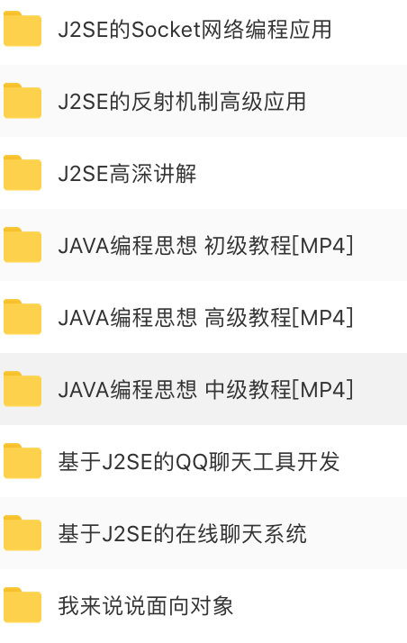
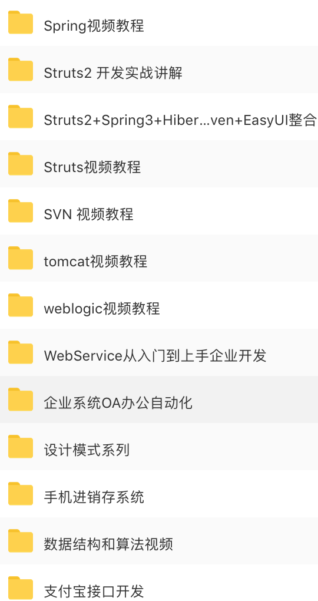
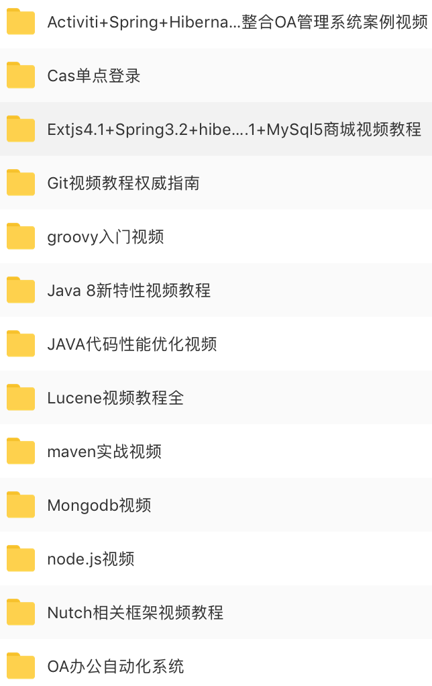
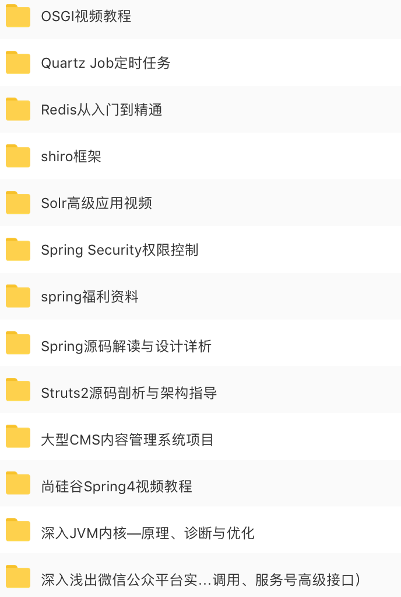
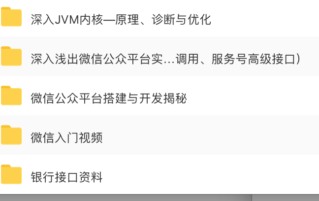
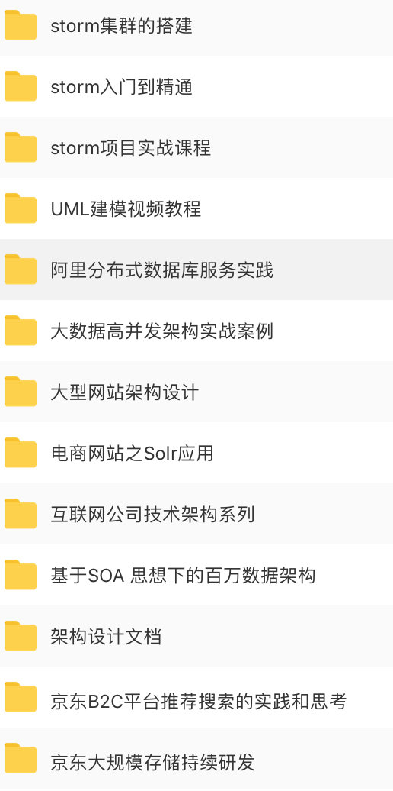

# 知识就摆在这里，就看你自己学不学

###  想要吊打面试官，你就需要做好准备，并不断学习

## 视频学习资料

### 面试题-视频版

链接: https://pan.baidu.com/s/1NQT7fzKU5hi7v1Y5Pu8V2g 提取码: f67h

### Java(架构师课程，动脑，咕泡)

链接:https://pan.baidu.com/s/1fevXlLxSidkQEhXu5OhvBg 提取码:qegc 

链接: https://pan.baidu.com/s/1JzfqeQLNHVUw17NOu2vKQw 提取码: qjyd 

`还有一部分架构师课程网盘不让分享，但上面的视频也够你看了，咕泡的视频可以先看，讲的挺好的`

不能分享部分，[查看截图](#其他)，若喜欢可以关注[【公众号】](#公众号)，发送百度网盘账号，单独发你

### 算法(九章)

链接: https://pan.baidu.com/s/1kdE3Jw4d2yKD32RqU_WlEg 提取码: d5iw

### 大数据(Flink, Spark)

链接:https://pan.baidu.com/s/1G4k_1B6NO4yCoc211UXpDA 提取码:pkgr 

### 机器学习

链接: https://pan.baidu.com/s/1rFA8EM7NXsJ2qL0tkxbDVg 提取码: 8n2g

## 其他

|  |  |
| ------------------------------------------------------------ | ------------------------------------------------------------ |
|  |  |
|  |  |
|  |  |

## 公众号

